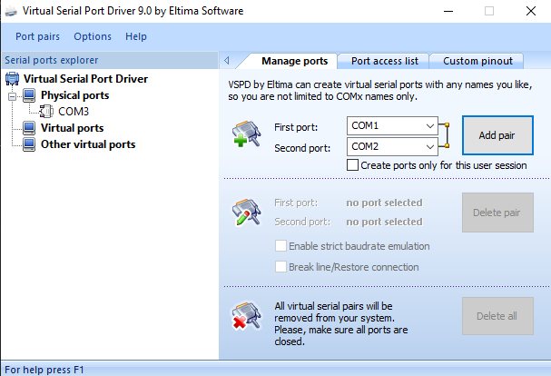
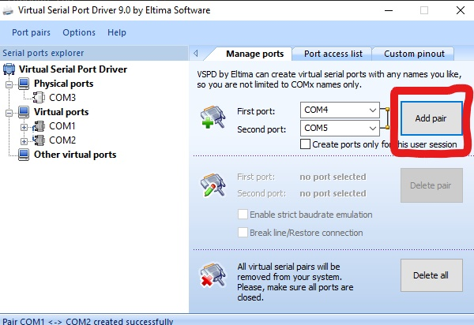
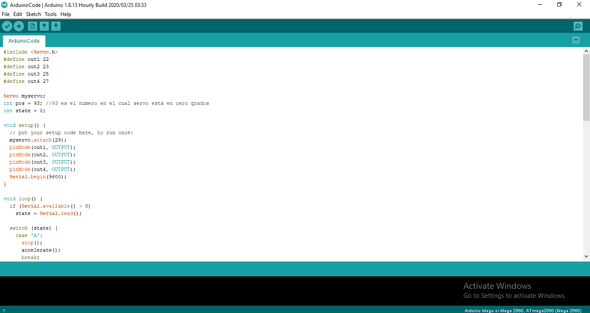
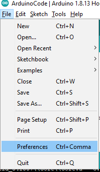
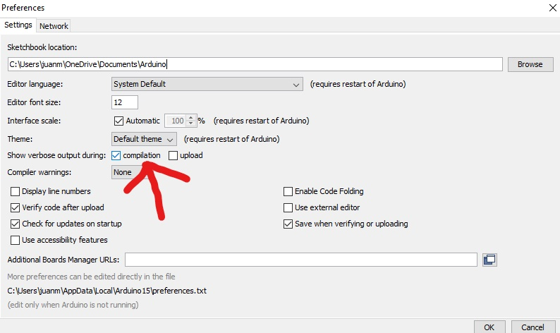
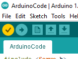
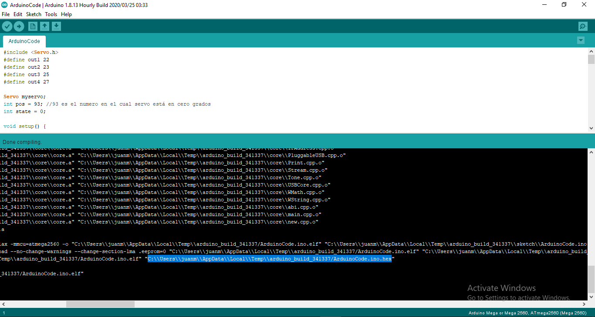
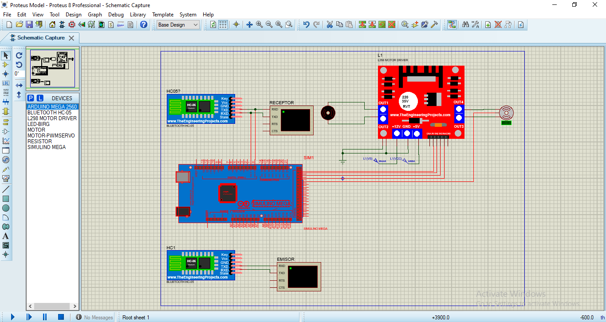
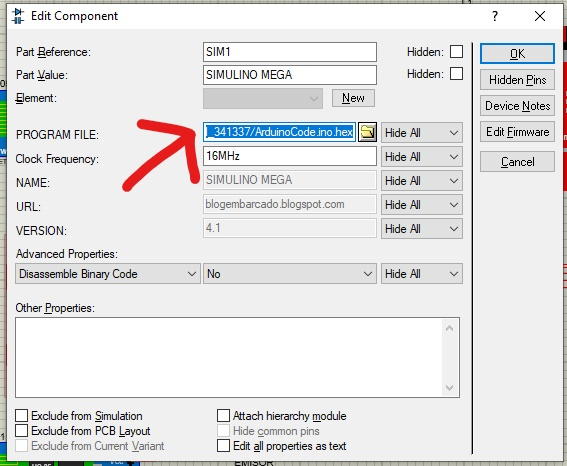
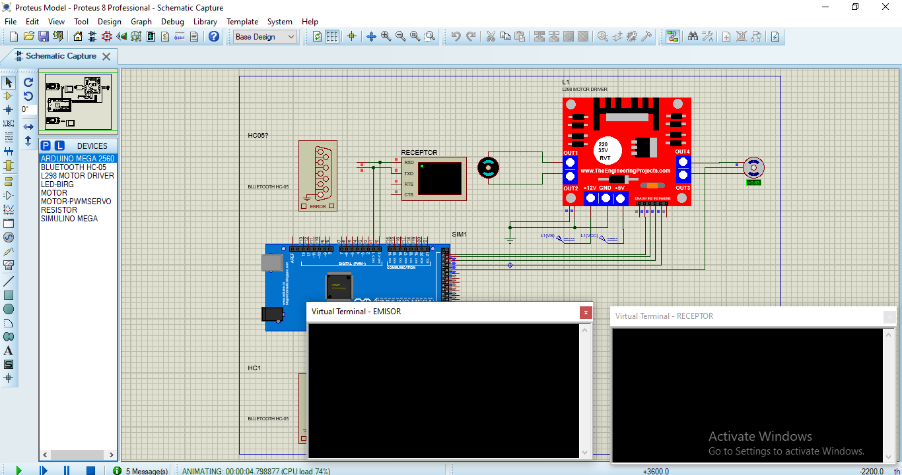

# Proteus Car Controller

This is a simulation of a car drived by bluetooth, through the emisor bluetooth (which could be a smartphone) the user can `accelerate`, `reverse`, `turn left`, `turn right`, `slow down` the motor, `speed up` the motor and `stop`.

## Software used

- [Arduino](arduino.cc).
- Proteus 8 Profesional (8.8 version).
- [Virtual Serial Port Driver](https://www.eltima.com/vspd-post-download.html) (from Etilma Software).

## Adding L289 Library to proteus
- You can download the library at this link: https://www.theengineeringprojects.com/2017/09/l298-motor-driver-library-proteus.html 
- Once you downloaded the rar file, open it and extract the files.
- You will get two files in it, named as:
    L298MotorDriverTEP.LIB
    L298MotorDriverTEP.IDX
- Place these two files in the Library folder of your Proteus Software.
- Now restart your Proteus software and search for L298 Motor Driver in the search box.
- Here is what it should look like:

## How to execute it?

Just follow the next steps:

1. Open Virtual Serial Port Driver.

2. Add pair.

3. Open the Arduino code in Arduino.

4. Go to preferences.

5. Check the `Show verbose output during compilation` option and press ok.

6. Verify the code (make sure your board is `Arduino Mega or Mega 2560`).

7. Select and copy the `.hex` path and the end of the console line.

8. Open the Proteus project.

9. Double click in the Arduino and paste the previously path.

10. Simulate.

## Methods inside the arduino file:
- Inside the loop method we have a switch case to see which command the user is giving to the program, so the following methods start to work:

1. accelerate() : as him name is saying this method accelerates the motor of the car.
2. reverse() : the method is responsible for reversing the car.
3. stop() : the method stops the car.
4. turnRight() : the method makes the car turn right.
5. turnLeft() : the method makes the car turn left.

## Simulation Options

- A: Accelerate the motor.
- B: Reverse the motor.
- S: Stop the motor.
- O: Slow down the motor.
- P: Speed Up the motor.
- L: Turn left 45 degrees the servo motor.
- R: Turn right 45 degrees the servo motor.
